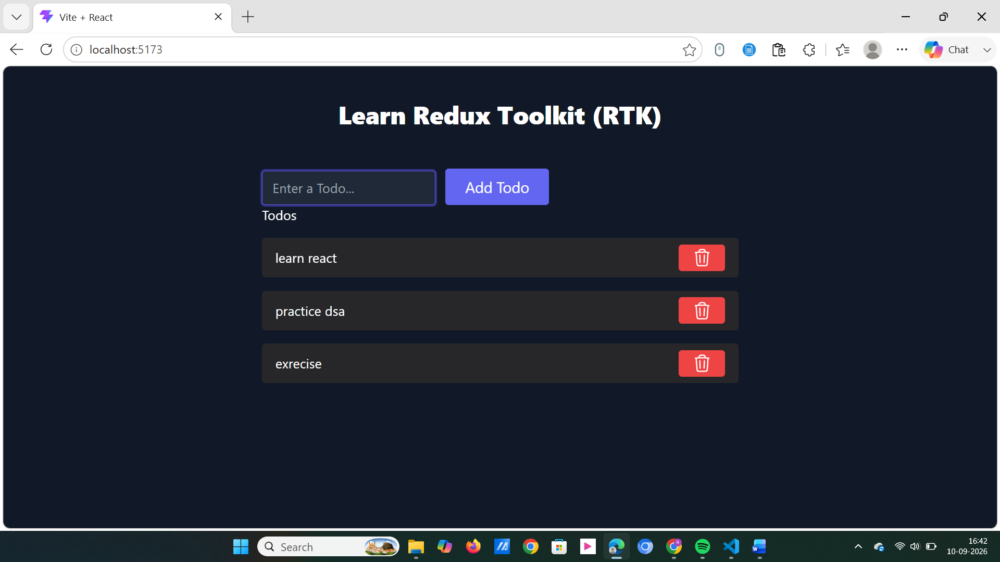

# ⚡ Redux Toolkit (RTK) Todo App

A scalable task management application built using modern **Redux Toolkit (RTK)** and **React-Redux** with Tailwind CSS. Demonstrates decoupled global state architecture, slice-based state mutations powered by Immer, and optimized component subscriptions.

---

## 📸 Preview



---

## 🚀 Key Features

- **Centralized Redux Store**: Single source of truth configured via RTK's `configureStore`.
- **Slice-Based Architecture**: Encapsulated state and reducer actions created via `createSlice`.
- **Simplified State Mutations**: Leverages **Immer** under the hood, allowing intuitive mutation syntax (`state.todos.push(...)`) while preserving strict immutability.
- **Selective Subscriptions**: High-performance state reading via `useSelector`, preventing unnecessary component re-renders.
- **Decoupled Dispatching**: Actions dispatched cleanly via `useDispatch` without prop-drilling.

---

## 🛠️ Tech Stack

- **React 18** (Vite)
- **@reduxjs/toolkit** (Modern Redux logic & slice management)
- **react-redux** (React bindings for store subscriptions and dispatching)
- **Tailwind CSS** (Utility-first styling & centered layout)

---

## 🧠 Core Architecture Breakdown

```text
               ┌───────────────────────────────┐
               │          Redux STORE          │
               │        (Central Bank)         │
               │   state.todo.todos = [...]    │
               └───────┬───────────────▲───────┘
                       │               │
       useSelector()   │               │  dispatch(action)
      (Subscribes to   │               │  (Dispatches addTodo,
       todo list)      │               │   removeTodo)
                       ▼               │
               ┌───────────────┐ ┌─────┴─────────┐
               │   Todos.jsx   │ │  AddTodo.jsx  │
               └───────────────┘ └───────────────┘